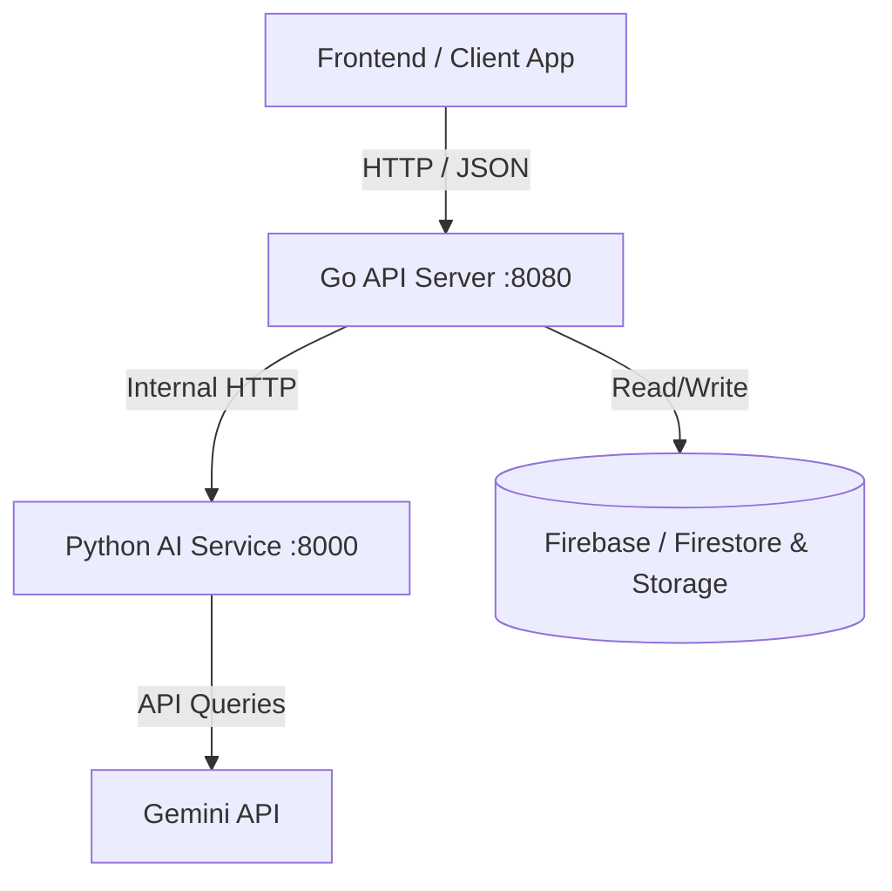

# RecoverPack Server 🛡️📸

RecoverPack is a disaster damage evidence package generator. It helps users organize damage photos, receipts, repair estimates, and disaster alert screenshots into a submission-ready evidence package for insurance companies, local government offices, landlords, or building management.

This repository is `recoverpack-server` and hosts the backend services.

---

## 🏗️ Architecture



1. **`go-api`** (Port `8080`):
   - Language: Go (v1.21+) with the Gin framework.
   - Handles public requests, metadata storage, timeline management, and packaging.
   - Communicates with the internal `ai-service`.
   - Stores data in Firebase Firestore and Storage (with a robust in-memory mock fallback if credentials are omitted).

2. **`ai-service`** (Port `8000`):
   - Language: Python (v3.10+) with FastAPI.
   - Analyzes damage images, classifies damage type, generates presentation-ready Korean captions, summarizes timelines, and writes final damage reports.
   - Utilizes Google's Gemini API (via the official `google-generativeai` SDK) or falls back to highly realistic mock data if `GEMINI_API_KEY` is missing.

---

## 📁 Repository Structure

```
recoverpack-server/
├─ go-api/                # Main Gin API Server
│  ├─ cmd/server/main.go  # Entry point
│  ├─ internal/           # Package domains
│  │  ├─ project/         # Projects management
│  │  ├─ file/            # Uploaded files metadata
│  │  ├─ evidence/        # Damage analysis results
│  │  ├─ timeline/        # Damage events & summaries
│  │  ├─ package/         # Evidence packages & PDF/Zip
│  │  ├─ ai/              # AI Service client wrapper
│  │  └─ firebase/        # Firebase/Firestore mock-fallback client
│  ├─ go.mod / go.sum
│  ├─ Dockerfile
│  └─ .env.example
├─ ai-service/            # Python AI Service
│  ├─ app/
│  │  ├─ main.py          # FastAPI application
│  │  ├─ schemas.py       # Pydantic schemas
│  │  ├─ analyzer.py      # Image & text analysis engine
│  │  ├─ prompts.py       # Core prompt strings
│  │  └─ gemini_client.py # Gemini SDK integration
│  ├─ requirements.txt
│  ├─ Dockerfile
│  └─ .env.example
├─ docker-compose.yml     # Local orchestration
└─ README.md
```

---

## 🚦 Important Product & AI Guardrails

RecoverPack is built on strict safety and legal guardrails to protect users:
* **No Compensation Decisions**: The AI must **never** decide or state eligibility for insurance compensation or government financial support.
* **No Speculation**: The AI must **never** state whether the user will or will not receive money/payouts.
* **Editable Content**: AI results (captions, categories, descriptions, timelines) are merely automated suggestions and **must always be editable by the user**.
* **Submission Support**: The final evidence package is marketed and labeled as a **"Submission Support Package"** and not as an official/legal document.

---

## 🚀 Getting Started

### Prerequisites
- Docker & Docker Compose
- *Optional*: Go (v1.21+), Python (v3.10+), `GEMINI_API_KEY` and Firebase account details.

### Running with Docker Compose (Recommended)

1. **Configure Environment**:
   Create a root `.env` or pass variables to your shell:
   ```env
   GEMINI_API_KEY=your_gemini_api_key_here
   FIREBASE_PROJECT_ID=your-firebase-project-id
   FIREBASE_STORAGE_BUCKET=your-bucket.appspot.com
   FIREBASE_CREDENTIALS_JSON={"type": "service_account", ...}
   ```
   *Note: If Firebase variables are left blank, the Go server automatically launches in **Local In-Memory Mock Mode**, permitting offline development.*

2. **Start the containers**:
   ```bash
   docker compose up --build
   ```

3. **Access Services**:
   - Go API: `http://localhost:8080`
   - AI Service (Internal/Admin): `http://localhost:8000`

---

## 📡 API Endpoints Reference

### Go API (`go-api`)

| Method | Endpoint | Description |
|---|---|---|
| `GET` | `/health` | Check health status of Go API server |
| `POST` | `/api/projects` | Create a new damage project |
| `POST` | `/api/projects/:projectId/files` | Register uploaded file metadata |
| `POST` | `/api/projects/:projectId/analyze` | Request AI analysis of registered files |
| `GET` | `/api/projects/:projectId/evidence` | Get list of analyzed evidence |
| `PATCH`| `/api/projects/:projectId/evidence/:evidenceId` | Update user-edited category/caption |
| `POST` | `/api/projects/:projectId/timeline` | Create or update timeline events |
| `GET` | `/api/projects/:projectId/timeline` | Get list of timeline events |
| `POST` | `/api/projects/:projectId/package` | Generate the current evidence package ZIP |
| `GET` | `/api/projects/:projectId/download` | Download the generated ZIP file |

The current ZIP contains UTF-8 text/CSV exports, structured JSON, and a
SHA-256 manifest for generated artifacts. Original binaries and PDF/XLSX
reports require the storage upload pipeline and are intentionally marked as
unavailable rather than fabricated.

### Python AI Service (`ai-service`)

| Method | Endpoint | Description |
|---|---|---|
| `GET` | `/health` | Check health status of FastAPI server |
| `POST` | `/internal/analyze-image` | Classify image and generate Korean caption |
| `POST` | `/internal/generate-description` | Generate damage description paragraph |
| `POST` | `/internal/generate-timeline` | Convert evidence details into a chronological timeline summary |
